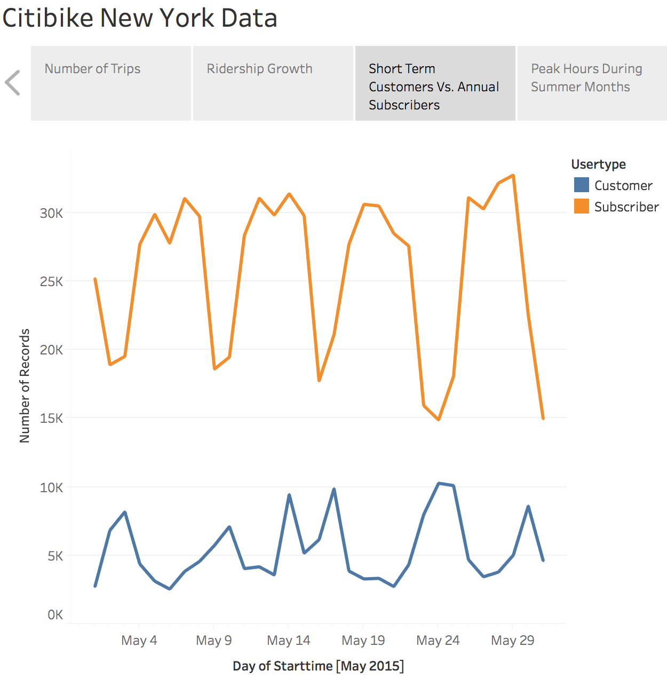

# CitiBike-Tableau

## Following is the analysis with respective visualizations:

### Total Number of trips

### Peak Summer and Winter Hours

### Top start stations

### Top end stations

### Ridership change

### Male, Female and Unknown riders

### Short term Customers Vs. Annual Subscribers

